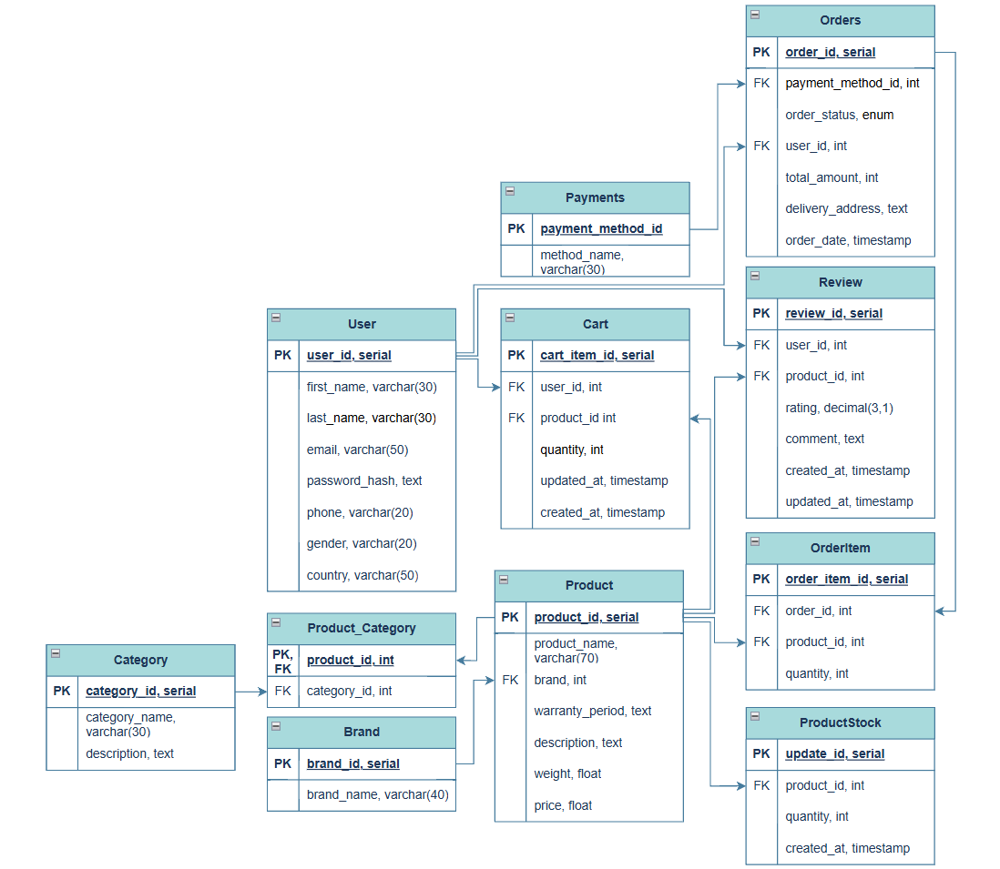
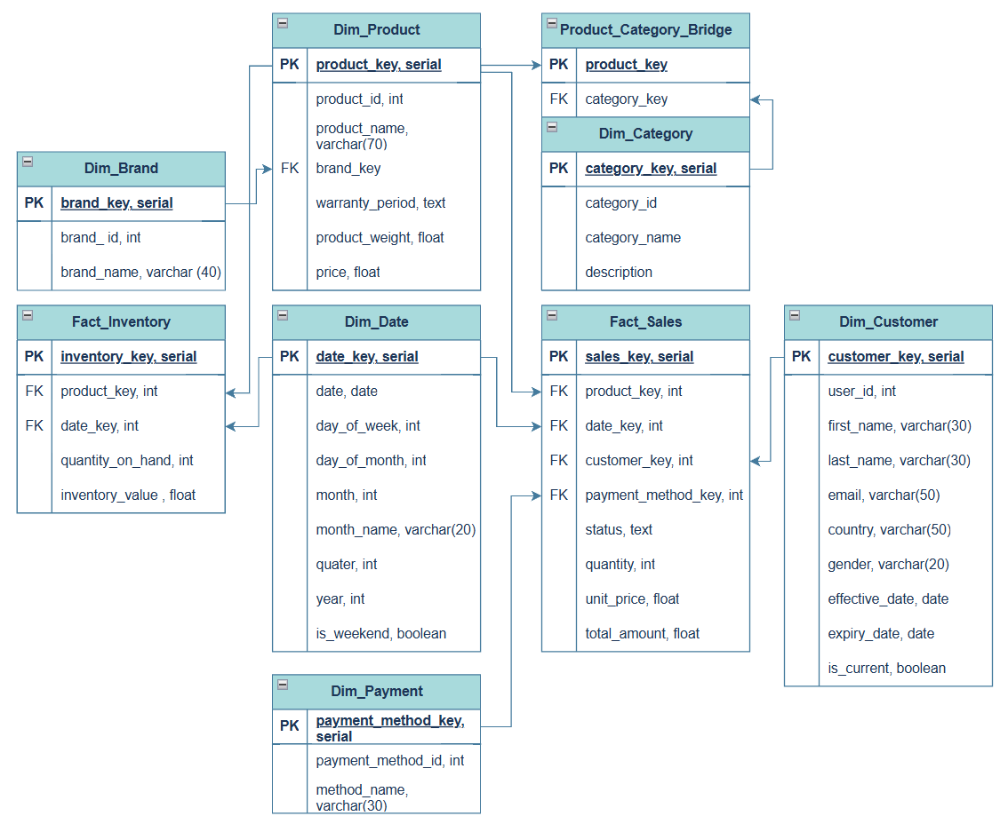
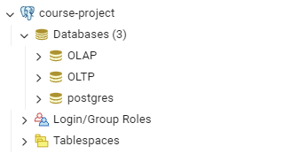
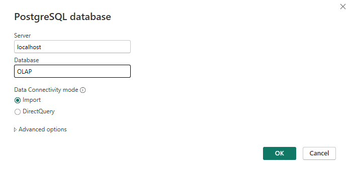

# Furniture online shop
## [OLTP Schema drawio](https://drive.google.com/file/d/1fWnT8FoM3RPAYJ3WG8XUpQknb7MenSDI/view?usp=sharing)

## [OLAP Schema drawio](https://drive.google.com/file/d/1xFycvNmwC0GrDE4jE6hV40HJjGrRMFXN/view?usp=sharing) 

# Installation

1. Create database with the following structure:
 - 
2. Initialize databases with scripts
 * [OLTP script](OLTP/OLTP_database_script.sql)
 * [OLAP script](OLAP/OLAP_database_script.SQL)
3. Fill OLTP database with sample data
 - [OLTP sample data script](OLTP/OLTP_sample_data.sql)
4. Run ETL script from OLAP database
 - [ETL Script](OLAP/ETL_script.SQL)
5. Import data from OLAP database to PowerBi(Get data -> More... -> PostgreSQL database)
 - 
